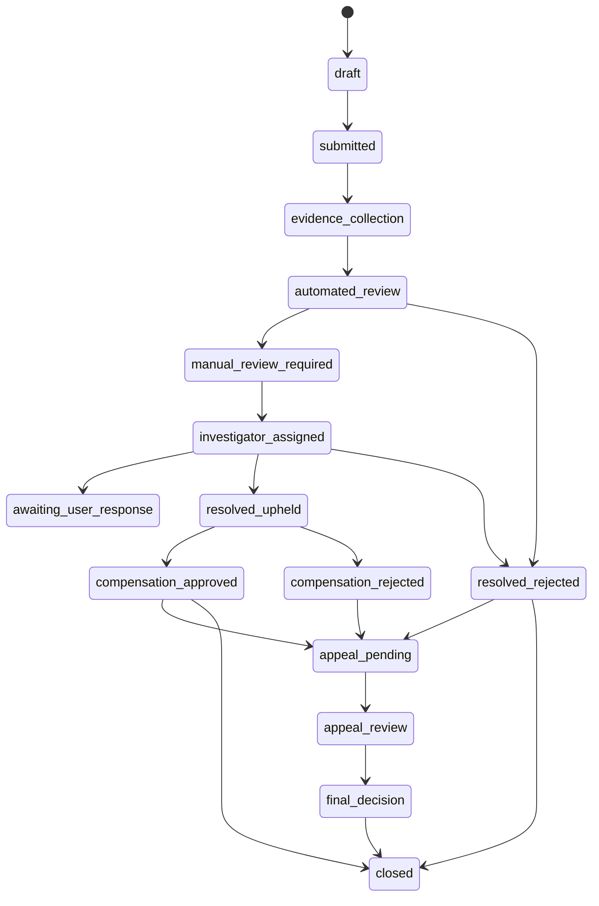

# Complaint State Machine

## Purpose

Define support case lifecycle for complaints, evidence, compensation, deduction, and appeals.

## Canonical States

`draft`, `submitted`, `evidence_collection`, `automated_review`, `manual_review_required`, `investigator_assigned`, `awaiting_user_response`, `resolved_upheld`, `resolved_rejected`, `compensation_approved`, `compensation_rejected`, `appeal_pending`, `appeal_review`, `final_decision`, `closed`.

## Transition Rules

| Source                      | Target                   | Actor                       | Required evidence                                                          | Notification            | Audit                 |
| --------------------------- | ------------------------ | --------------------------- | -------------------------------------------------------------------------- | ----------------------- | --------------------- |
| `draft`                     | `submitted`              | Rider, driver, operator     | Category, description, linked entity where available.                      | Submitter confirmation. | Submission event.     |
| `submitted`                 | `evidence_collection`    | Server                      | Auto-attach eligible ride, payment, payout, Black Box, support references. | Optional.               | Evidence references.  |
| `evidence_collection`       | `automated_review`       | Server                      | Minimum evidence collected or timeout.                                     | Optional.               | Classification event. |
| `automated_review`          | `manual_review_required` | Rules/server                | Financial, safety, ambiguous, or high-impact case.                         | Operations queue.       | Rule decision.        |
| `manual_review_required`    | `investigator_assigned`  | Support lead/server         | Authorized reviewer available.                                             | Internal.               | Assignment event.     |
| `investigator_assigned`     | `awaiting_user_response` | Reviewer                    | Missing user evidence.                                                     | User response request.  | Request event.        |
| `investigator_assigned`     | `resolved_upheld`        | Reviewer                    | Evidence supports complaint.                                               | Parties as appropriate. | Decision event.       |
| `investigator_assigned`     | `resolved_rejected`      | Reviewer                    | Evidence does not support complaint.                                       | Submitter.              | Decision event.       |
| `resolved_upheld`           | `compensation_approved`  | Authorized reviewer/finance | Source, amount, reason, legal/fairness basis.                              | Affected parties.       | Financial approval.   |
| `resolved_upheld`           | `compensation_rejected`  | Reviewer/finance            | Reason compensation not appropriate.                                       | Submitter.              | Decision event.       |
| Any eligible resolved state | `appeal_pending`         | User                        | Appeal within configured window.                                           | Parties as appropriate. | Appeal event.         |
| `appeal_pending`            | `appeal_review`          | Reviewer                    | Appeal evidence.                                                           | Internal.               | Assignment event.     |
| `appeal_review`             | `final_decision`         | Appeal reviewer             | Final outcome.                                                             | Parties.                | Final decision.       |
| `final_decision`            | `closed`                 | Server/reviewer             | Notifications and financial actions completed.                             | Closure.                | Closure event.        |

## Business Rules

- Duplicate complaint prevention links repeated reports to existing cases.
- Abusive complaint handling requires reason codes and review.
- Compensation and deductions require financial controls.
- Evidence retention is configurable and legally reviewed.

## Acceptance Criteria

- Complaint states support evidence, manual review, compensation, appeals, and closure.
