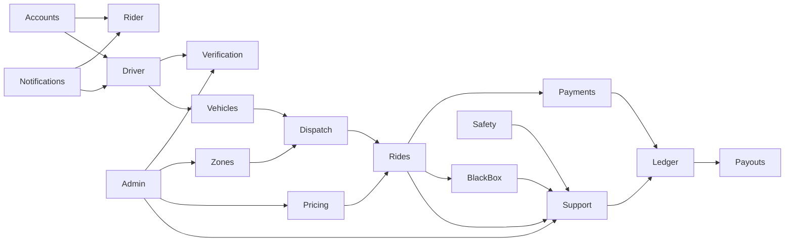

# Domain Boundaries

## Purpose

Define SuperNova's product domains and ownership boundaries before database schema or feature implementation.

## Scope

Domains cover accounts, identity, vehicles, service zones, dispatch, rides, pricing, payments, ledger, payouts, support, safety, notifications, admin operations, localization, risk, analytics, and audit.

## Domain Map

## Boundaries

| Domain              | Owns                                                                                           | Does not own                                                   |
| ------------------- | ---------------------------------------------------------------------------------------------- | -------------------------------------------------------------- |
| Accounts            | Rider/driver account identity, device sessions, account status.                                | Payment credentials, document verification decisions.          |
| Driver Verification | Application states, identity evidence, license evidence, review outcomes.                      | Vehicle category policy, payout provider state.                |
| Vehicles            | Vehicle records, eligibility evidence, vehicle state, category fit.                            | Driver identity approval.                                      |
| Service Zones       | Zone availability, pickup/destination controls, hours, categories, pricing profile references. | Fare calculation internals.                                    |
| Dispatch            | Candidate filtering, offers, assignment, reassignment, no-driver outcome.                      | Final fare, payment capture.                                   |
| Rides               | Ride lifecycle, cancellation reasons, timestamps, QR/PIN start verification.                   | Provider payment state, ledger settlement.                     |
| Pricing             | Pricing profiles, fare estimate metadata, commission profiles.                                 | Payment provider authorization.                                |
| Payments            | Payment intents, authorization, capture, refunds, chargebacks, reconciliation.                 | Driver balance derivation beyond ledger entries.               |
| Ledger              | Immutable driver financial entries and derived balances.                                       | Provider transfer execution.                                   |
| Payouts             | Payout requests, provider references, payout states, retries, reversals.                       | Ride dispatch or fare estimate.                                |
| Support             | Complaint states, evidence workflow, decisions, appeals.                                       | Direct mutation of historical ride events.                     |
| Safety              | Safety events, SOS workflow, risk flags, evidence access policy.                               | Legal emergency-service commitments.                           |
| Trip Black Box      | Ordered structured trip telemetry and event batches.                                           | Continuous audio/video recording.                              |
| Notifications       | Event templates, channel policy, dedupe, retry, expiry.                                        | Source-of-truth domain state.                                  |
| Admin Operations    | Role-bound operational workflows and approvals.                                                | Unlimited implicit data access.                                |
| Localization        | Translation keys, RTL/LTR readiness, locale formatting.                                        | Hardcoded app strings.                                         |
| Risk and Fraud      | Risk signals, review flags, abuse indicators.                                                  | Protected-characteristic scoring or opaque final AI authority. |
| Audit               | Immutable operational history and evidence access logs.                                        | Business decision authority.                                   |

## Business Rules

- Domains communicate through explicit events and references.
- Financial domains must be idempotent.
- Support disputes reference historical ride/payment/ledger records instead of rewriting them.
- Admin workflows must use domain APIs rather than direct sensitive state mutation.

## Security Rules

Every domain maps data to [Data Classification](../security/data-classification.md). Permission boundaries are defined in [Authorization Model](../security/authorization-model.md).

## Open Decisions

Provider-specific subdomains are deferred until payment, payout, map, route, and emergency-service providers are approved.

## Acceptance Criteria

- Domain ownership is explicit.
- No product feature or schema implementation is introduced.
