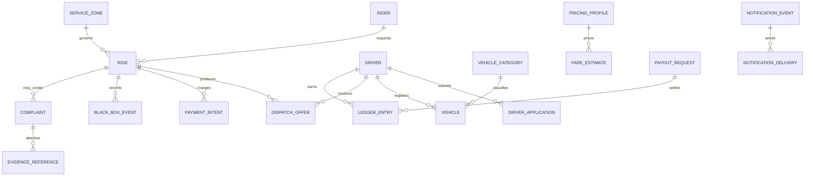

# Domain Model

## Purpose

Describe major SuperNova domain entities and relationships without creating database schema.

## Scope

This model is conceptual and provider-neutral. It guides later schema and service design.

## Conceptual Relationships

## Major Entities

| Entity             | Purpose                                            | Key considerations                                                                  |
| ------------------ | -------------------------------------------------- | ----------------------------------------------------------------------------------- |
| Rider              | Requests and pays for rides.                       | Phone verification, account status, trusted contact, deletion/anonymization status. |
| Driver             | Independent driver account.                        | Verification state, risk state, payout readiness, document expiry.                  |
| Driver Application | Captures onboarding evidence and review decisions. | Three verification levels; no assumed government access.                            |
| Vehicle            | Eligible private vehicle used by driver.           | Configurable category rules, model year, documents, photos, inspections.            |
| Vehicle Category   | Configurable mobility category.                    | Different model years, capacity, safety features, zone availability, pricing.       |
| Service Zone       | Configurable operational geography.                | Active/paused, pickup/destination permissions, hours, demand controls, audit.       |
| Ride               | Server-authoritative trip lifecycle.               | Strict state machine, cancellation terminal states, immutable timestamps.           |
| Dispatch Offer     | Offer from dispatch to candidate driver.           | Expiration, atomic acceptance, reassignment.                                        |
| Fare Estimate      | Pre-trip fare projection.                          | Route source, pricing version, validity window, assumptions.                        |
| Payment Intent     | Online payment lifecycle.                          | Authorization, capture, refund, chargeback, webhook idempotency.                    |
| Ledger Entry       | Immutable driver financial event.                  | Integer minor units, currency, correction by compensating entry.                    |
| Payout Request     | Movement of available balance to destination.      | Idempotency, provider reference, retries, reversal.                                 |
| Complaint          | Support and resolution case.                       | Evidence, review, compensation, deduction, appeal.                                  |
| Evidence Reference | Pointer to evidence object or event.               | Classification, access logging, retention.                                          |
| Black Box Event    | Ordered trip event or telemetry item.              | Batching, sequence, integrity, minimization, access control.                        |
| Notification Event | Domain event needing user/operator message.        | Localization, dedupe, retry, expiry, privacy classification.                        |
| Audit Event        | Immutable operational record.                      | Actor, reason, before/after, evidence reference, session.                           |

## Service Zone Configuration

Every zone supports active or paused state, pickup permission, destination permission, supported vehicle categories, pricing profile, operating hours, minimum supply thresholds, demand controls, safety or compliance restrictions, temporary suspension, effective dates, and audit history.

Example zones such as Nasr City, Heliopolis, New Cairo, Maadi, Downtown Cairo, Dokki, Mohandessin, Agouza, Haram, Faisal, 6th of October, and Sheikh Zayed are planning examples, not hardcoded requirements.

## Vehicle Category Configuration

Category-specific rules may include minimum model year, passenger capacity, luggage capacity, required safety features, air-conditioning, inspection requirements, photo requirements, service eligibility, zone availability, and pricing rules.

## Business Rules

- Conceptual entities do not imply database tables yet.
- Schema implementation must preserve domain ownership and state-machine rules.
- All money fields use integer minor units and currency.
- All timestamps persist in UTC.

## Open Decisions

Final data retention periods, provider-specific fields, legal category rules, payment tokenization fields, and government verification fields remain open.

## Acceptance Criteria

- Major entities and relationships are documented.
- Entity considerations include safety, finance, audit, and privacy boundaries.
