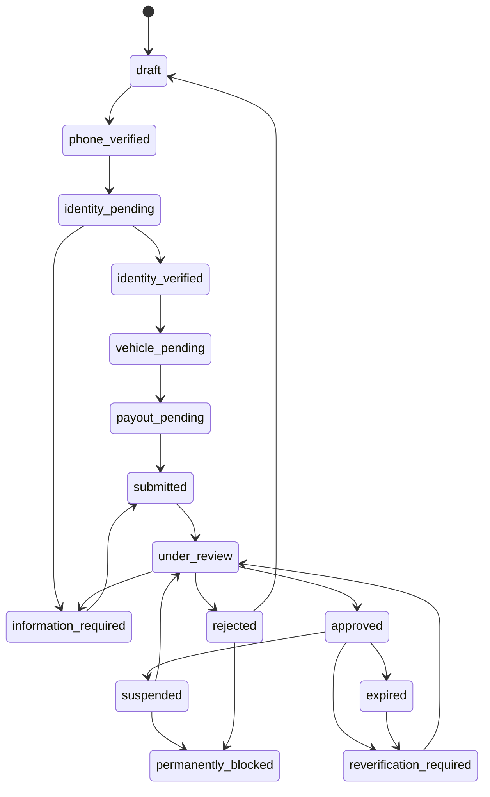

# Driver Verification State Machine

## Purpose

Define driver onboarding, review, expiry, reactivation, and blocking states.

## Canonical States

`draft`, `phone_verified`, `identity_pending`, `identity_verified`, `vehicle_pending`, `payout_pending`, `submitted`, `under_review`, `information_required`, `approved`, `rejected`, `suspended`, `expired`, `reverification_required`, `permanently_blocked`.

## Transition Rules

| Source                                   | Target                    | Actor                       | Required evidence                                                                 | Reason codes              | Appeal eligibility                               | Audit                     |
| ---------------------------------------- | ------------------------- | --------------------------- | --------------------------------------------------------------------------------- | ------------------------- | ------------------------------------------------ | ------------------------- |
| `draft`                                  | `phone_verified`          | Driver/server               | OTP verification success.                                                         | Not required.             | No.                                              | Phone verification event. |
| `phone_verified`                         | `identity_pending`        | Driver                      | Personal details, address, national ID, license, selfie/liveness where available. | Not required.             | No.                                              | Submission metadata.      |
| `identity_pending`                       | `identity_verified`       | Server/reviewer             | Automated format checks and manual review evidence.                               | Approval code.            | No.                                              | Review decision.          |
| `identity_pending` or `under_review`     | `information_required`    | Reviewer                    | Missing/unclear evidence.                                                         | Information request code. | Not applicable.                                  | Request details.          |
| `identity_verified`                      | `vehicle_pending`         | Driver/server               | Identity complete.                                                                | Not required.             | No.                                              | State change.             |
| `vehicle_pending`                        | `payout_pending`          | Vehicle reviewer/server     | Vehicle approved or accepted for onboarding path.                                 | Vehicle approval code.    | Vehicle rejection appeal per policy.             | Vehicle decision.         |
| `payout_pending`                         | `submitted`               | Driver                      | Payout destination, agreements, consent.                                          | Not required.             | No.                                              | Submission event.         |
| `submitted`                              | `under_review`            | Server                      | Complete application.                                                             | Not required.             | No.                                              | Queue event.              |
| `under_review`                           | `approved`                | Reviewer                    | Identity, license, vehicle, payout readiness, agreements.                         | Approval code.            | Not applicable.                                  | Approval event.           |
| `under_review`                           | `rejected`                | Reviewer                    | Review evidence.                                                                  | Rejection code.           | Configurable.                                    | Rejection event.          |
| `approved`                               | `suspended`               | Safety/risk/ops             | Safety, compliance, fraud, document, or support evidence.                         | Suspension code.          | Usually yes unless severe policy says otherwise. | Suspension event.         |
| `approved`                               | `expired`                 | Server                      | Document expiry.                                                                  | Expiry code.              | Renewal rather than appeal.                      | Expiry event.             |
| `approved` or `expired`                  | `reverification_required` | Server/reviewer             | Expiry, periodic review, policy change, risk signal.                              | Reverification code.      | Not applicable.                                  | Reverification event.     |
| `suspended` or `reverification_required` | `under_review`            | Driver/reviewer             | Updated evidence or appeal.                                                       | Review code.              | Yes where eligible.                              | Reactivation review.      |
| `suspended` or `rejected`                | `permanently_blocked`     | Authorized safety/risk role | Severe evidence and approval.                                                     | Permanent block code.     | Configured appeal only.                          | High-severity audit.      |

## Verification Levels

1. Automated document and format checks.
2. Manual platform review.
3. Official authority verification only when a lawful integration or agreement becomes available.

## Business Rules

- Do not claim residency at the national-ID address can be verified without approved lawful source.
- Document expiry removes dispatch eligibility until renewal or approved exception.
- Reactivation requires evidence and audit.

## Acceptance Criteria

- Every transition has actor, evidence, reason/audit expectations, and appeal behavior.
