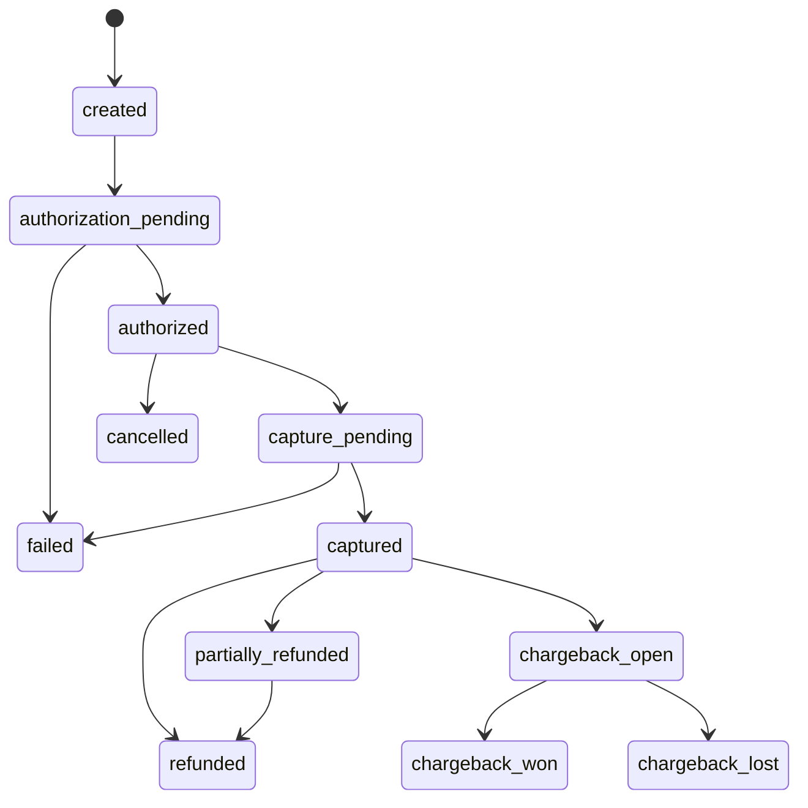

# Payment State Machine

## Purpose

Define provider-neutral online payment lifecycle states.

## Canonical States

`created`, `authorization_pending`, `authorized`, `capture_pending`, `captured`, `failed`, `cancelled`, `partially_refunded`, `refunded`, `chargeback_open`, `chargeback_won`, `chargeback_lost`.

## Transition Rules

| Source                             | Target                  | Initiator               | Validations                                      | Idempotency           | Ledger effect                              | Notification                | Failure behavior                            |
| ---------------------------------- | ----------------------- | ----------------------- | ------------------------------------------------ | --------------------- | ------------------------------------------ | --------------------------- | ------------------------------------------- |
| `created`                          | `authorization_pending` | Server                  | Payment method present, amount/currency valid.   | Payment intent key.   | None.                                      | Rider pending.              | Fail before dispatch.                       |
| `authorization_pending`            | `authorized`            | Provider webhook/server | Provider reference valid, amount/currency match. | Webhook event key.    | None.                                      | Rider confirmation.         | Duplicate ignored.                          |
| `authorization_pending`            | `failed`                | Provider/server         | Failure code captured.                           | Payment intent key.   | None.                                      | Rider failure.              | Ride may retry or `payment_failed`.         |
| `authorized`                       | `capture_pending`       | Ride completion         | Ride completion processing, final fare ready.    | Capture key.          | Pending settlement.                        | Rider/driver pending.       | Retry under policy.                         |
| `capture_pending`                  | `captured`              | Provider webhook/server | Capture amount/currency match.                   | Webhook event key.    | Ride gross and commission entries created. | Receipt, driver earnings.   | Reconcile if webhook delayed.               |
| `authorized`                       | `cancelled`             | Server                  | Ride cancelled before capture.                   | Cancel key.           | None or release hold.                      | Rider.                      | Provider reconciliation if release delayed. |
| `captured`                         | `partially_refunded`    | Finance/support         | Approved reason, amount less than captured.      | Refund key.           | Refund debit/adjustment entries.           | Rider/driver if affected.   | Manual review on provider failure.          |
| `captured` or `partially_refunded` | `refunded`              | Finance/support         | Approved full refund.                            | Refund key.           | Refund debit/adjustment entries.           | Rider/driver if affected.   | Manual review on provider failure.          |
| `captured`                         | `chargeback_open`       | Provider                | Chargeback reference valid.                      | Provider dispute key. | Reserve or debit as configured.            | Finance alert.              | Review evidence.                            |
| `chargeback_open`                  | `chargeback_won`        | Provider                | Outcome confirmed.                               | Provider dispute key. | Reserve release if held.                   | Finance.                    | Audit outcome.                              |
| `chargeback_open`                  | `chargeback_lost`       | Provider                | Outcome confirmed.                               | Provider dispute key. | Chargeback debit.                          | Finance/driver if affected. | Support review.                             |

## Business Rules

- Manual screenshot transfers are not reliable automated payment.
- Duplicate webhooks cannot duplicate money movement.
- Provider outage must not create untracked financial state.
- Failed completion has rider communication and support path.

## Audit Events

Payment intent creation, authorization request, authorization webhook, capture request, capture webhook, failure, cancellation, refund, partial refund, chargeback open, chargeback outcome, reconciliation correction.

## Acceptance Criteria

- No provider is selected.
- State model supports authorization, capture, refunds, partial refunds, chargebacks, retries, reconciliation, and duplicate webhooks.
