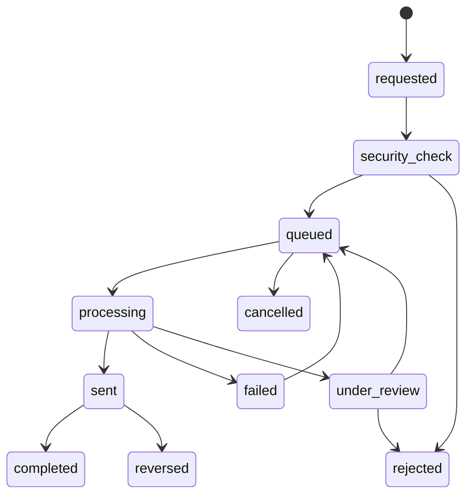

# Payout State Machine

## Purpose

Define driver payout lifecycle for daily automatic payouts and on-demand withdrawals.

## Canonical States

`requested`, `security_check`, `queued`, `processing`, `sent`, `completed`, `failed`, `rejected`, `cancelled`, `reversed`, `under_review`.

## Transition Rules

| Source           | Target           | Initiator             | Provider responsibility             | Balance effect                                              | Retry behavior                            | Idempotency key          | Notification           | Manual intervention                 |
| ---------------- | ---------------- | --------------------- | ----------------------------------- | ----------------------------------------------------------- | ----------------------------------------- | ------------------------ | ---------------------- | ----------------------------------- |
| `requested`      | `security_check` | Driver or scheduler   | None.                               | Move eligible amount toward payout_pending reservation.     | No retry needed.                          | Payout request key.      | Driver pending.        | Review suspicious request.          |
| `security_check` | `queued`         | Server                | None.                               | Reserve available balance.                                  | Retry if transient internal failure.      | Security check key.      | Driver queued.         | Risk review may hold.               |
| `security_check` | `rejected`       | Risk/finance/server   | None.                               | Release reservation.                                        | No automatic retry unless reason permits. | Decision key.            | Driver rejected.       | Appeal/support path.                |
| `queued`         | `processing`     | Server                | Submit to provider.                 | Balance remains payout_pending.                             | Retry submission under policy.            | Provider submission key. | Optional.              | Finance review on repeated failure. |
| `processing`     | `sent`           | Provider/server       | Provider accepted transfer.         | Payout debit recorded or remains pending per ledger policy. | Reconcile if webhook delayed.             | Provider reference.      | Driver sent.           | Track provider delay.               |
| `sent`           | `completed`      | Provider/server       | Provider confirms completion.       | Paid balance reflected by ledger.                           | Duplicate completion ignored.             | Provider webhook key.    | Driver completed.      | None unless mismatch.               |
| `processing`     | `failed`         | Provider/server       | Failure reason.                     | Release or keep reservation according to retry policy.      | Automatic retry if allowed.               | Provider webhook key.    | Driver failed.         | Finance review.                     |
| `sent`           | `reversed`       | Provider/server       | Reversal reference.                 | Payout reversal credit.                                     | No duplicate reversal.                    | Reversal key.            | Driver and finance.    | Investigate.                        |
| `queued`         | `cancelled`      | Driver/server         | None unless provider not submitted. | Release reservation.                                        | No retry.                                 | Cancel key.              | Driver.                | Only before processing.             |
| `processing`     | `under_review`   | Provider/finance/risk | Provider delay or mismatch.         | Hold pending balance.                                       | Manual retry after review.                | Review key.              | Driver limited detail. | Required.                           |

## Business Rules

- Daily payouts use Africa/Cairo schedule and configurable payout time.
- On-demand withdrawal respects minimum amount, daily limits, holds, provider capabilities, fees, and step-up verification where appropriate.
- Payout must never duplicate.
- Instant transfer is not promised until supported by selected provider.

## Audit Events

Payout request, security check, queue, provider submission, sent, completed, failed, rejected, cancelled, reversed, retry, manual review, provider reference update.

## Acceptance Criteria

- Payout states include provider and balance effects.
- Daily and on-demand payout behavior is represented.
