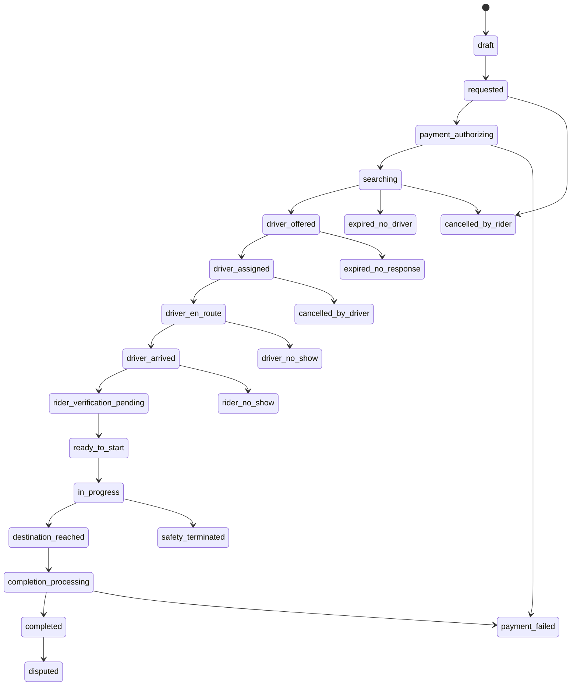

# Ride State Machine

## Purpose

Define the canonical ride lifecycle and transition controls.

## Canonical States

Active states: `draft`, `requested`, `payment_authorizing`, `searching`, `driver_offered`, `driver_assigned`, `driver_en_route`, `driver_arrived`, `rider_verification_pending`, `ready_to_start`, `in_progress`, `destination_reached`, `completion_processing`, `completed`, `disputed`.

Terminal cancellation states: `cancelled_by_rider`, `cancelled_by_driver`, `cancelled_by_system`, `expired_no_driver`, `expired_no_response`, `rider_no_show`, `driver_no_show`, `safety_terminated`, `payment_failed`.

## Transition Rules

| Source                       | Target                       | Initiating actor                 | Server validations                                            | Timestamps                  | Location                                        | Payment                              | Retries and idempotency           | Event                        | Notifications                   | Audit and failure behavior                    |
| ---------------------------- | ---------------------------- | -------------------------------- | ------------------------------------------------------------- | --------------------------- | ----------------------------------------------- | ------------------------------------ | --------------------------------- | ---------------------------- | ------------------------------- | --------------------------------------------- |
| `draft`                      | `requested`                  | Rider                            | Rider active, pickup/destination allowed, category available. | `requested_at`              | Pickup and destination present.                 | Payment method selected.             | Request idempotency key.          | `ride.requested`             | Rider in-app/push.              | Reject if zone paused.                        |
| `requested`                  | `payment_authorizing`        | Server                           | Estimate valid, payment method usable.                        | `payment_authorizing_at`    | No new requirement.                             | Create/authorize payment intent.     | Payment intent idempotency.       | `ride.payment_authorizing`   | Rider.                          | Failure goes to retry or `payment_failed`.    |
| `payment_authorizing`        | `searching`                  | Payment domain                   | Authorization policy satisfied.                               | `searching_at`              | Pickup freshness checked.                       | Authorized or approved precondition. | Webhook/request idempotency.      | `ride.searching`             | Rider ops optional.             | Failure to `payment_failed`.                  |
| `searching`                  | `driver_offered`             | Dispatch                         | Candidate eligible, online, category/zone valid, GPS fresh.   | `offered_at`                | Candidate distance/ETA available.               | Authorization still valid.           | Offer idempotency.                | `dispatch.offer_created`     | Driver.                         | Offer expires to next candidate or no-driver. |
| `driver_offered`             | `driver_assigned`            | Driver                           | Offer active, driver still eligible, atomic acceptance.       | `assigned_at`               | Driver location fresh.                          | Authorization still valid.           | Atomic unique assignment.         | `ride.driver_assigned`       | Rider, driver.                  | Loser accept receives stale offer response.   |
| `driver_assigned`            | `driver_en_route`            | Driver/app                       | Driver has accepted and navigation started.                   | `en_route_at`               | Driver location available.                      | No capture.                          | Idempotent mark.                  | `ride.driver_en_route`       | Rider.                          | Reject if unassigned.                         |
| `driver_en_route`            | `driver_arrived`             | Driver                           | Within configured arrival radius or manual review rule.       | `arrived_at`                | Pickup proximity required.                      | No capture.                          | Idempotent mark.                  | `ride.driver_arrived`        | Rider.                          | Failure keeps en route.                       |
| `driver_arrived`             | `rider_verification_pending` | Server                           | Arrival confirmed, verification token generated.              | `verification_available_at` | Pickup proximity.                               | Authorization valid.                 | Token scoped to ride.             | `ride.verification_pending`  | Rider, driver.                  | No plain reusable credential storage.         |
| `rider_verification_pending` | `ready_to_start`             | Rider/driver                     | QR or PIN valid, single-use, short-lived, rate-limited.       | `verified_at`               | Driver still at pickup unless policy exception. | Authorization valid.                 | Verification attempt idempotency. | `ride.verified_to_start`     | Rider, driver.                  | Invalid attempts logged.                      |
| `ready_to_start`             | `in_progress`                | Driver requests, server confirms | Assigned driver, verified rider, no terminal state.           | `started_at`                | Start location captured with accuracy.          | Authorization valid.                 | Start idempotency.                | `ride.started`               | Rider, trusted contact, driver. | Offline start rejected.                       |
| `in_progress`                | `destination_reached`        | Driver/app                       | Destination proximity or approved manual end.                 | `destination_reached_at`    | End location captured.                          | No capture yet.                      | Idempotent mark.                  | `ride.destination_reached`   | Rider, driver.                  | Manual review if outside destination.         |
| `destination_reached`        | `completion_processing`      | Server                           | End data, route, waiting, tolls, adjustments ready.           | `completion_processing_at`  | Route summary available or fallback.            | Capture begins.                      | Settlement idempotency.           | `ride.completion_processing` | Rider, driver.                  | Failure stays reviewable.                     |
| `completion_processing`      | `completed`                  | Payment/ledger domains           | Capture/settlement complete or approved resolution.           | `completed_at`              | Final route facts frozen.                       | Captured/resolved.                   | Settlement idempotency.           | `ride.completed`             | Rider, driver.                  | Receipt issued.                               |
| `completed`                  | `disputed`                   | Rider, driver, support           | Complaint eligible and linked.                                | `disputed_at`               | Evidence references attached.                   | Financial records remain immutable.  | Complaint idempotency.            | `ride.disputed`              | Support, parties as needed.     | Does not rewrite ride history.                |

## Cancellation and Terminal Rules

| Source states                                                                                                             | Target                | Initiating actor       | Required controls                                                     |
| ------------------------------------------------------------------------------------------------------------------------- | --------------------- | ---------------------- | --------------------------------------------------------------------- |
| `requested`, `payment_authorizing`, `searching`, `driver_offered`, `driver_assigned`, `driver_en_route`, `driver_arrived` | `cancelled_by_rider`  | Rider                  | Reason code, cancellation fee policy, timestamp, notification, audit. |
| `driver_assigned`, `driver_en_route`, `driver_arrived`                                                                    | `cancelled_by_driver` | Driver                 | Reason code, acceptance/cancellation policy, notification, audit.     |
| Any non-terminal active state                                                                                             | `cancelled_by_system` | Server/operator        | Reason code, operator/system actor, notification, audit.              |
| `searching`                                                                                                               | `expired_no_driver`   | Dispatch               | Search timeout, no eligible candidate, rider notification.            |
| `driver_offered`                                                                                                          | `expired_no_response` | Dispatch               | Offer timeout, candidate retry or final expiry.                       |
| `driver_arrived`                                                                                                          | `rider_no_show`       | Driver/server          | Wait threshold, location evidence, notification, fee policy.          |
| `driver_assigned`, `driver_en_route`                                                                                      | `driver_no_show`      | Rider/support/server   | Evidence and configured threshold.                                    |
| Any active trip state                                                                                                     | `safety_terminated`   | Safety/server/operator | Safety reason, evidence, escalation, notifications, audit.            |
| `payment_authorizing`, `completion_processing`                                                                            | `payment_failed`      | Payment/server         | Failed auth/capture after retries, support path.                      |

## QR and PIN Rules

QR and PIN are generated server-side, scoped to one ride and assigned rider/driver, single-use, short-lived, rotated after reassignment, unavailable before driver arrival, rate-limited, logged on invalid attempt, and require server confirmation before trip start.

## Acceptance Criteria

- A ride cannot be accepted by two drivers.
- A ride cannot start before assignment and rider verification.
- Completed rides cannot return to active states.
- Disputes do not rewrite historical ride events.
