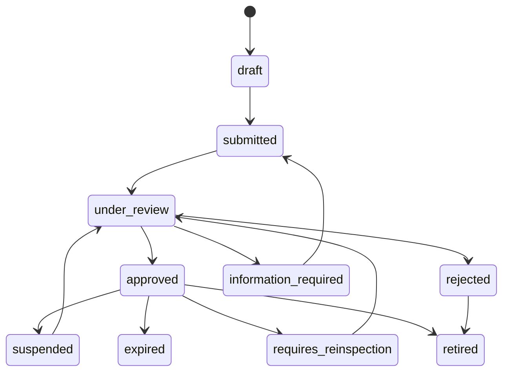

# Vehicle State Machine

## Purpose

Define vehicle approval and eligibility states for legally eligible licensed private vehicles.

## Canonical States

`draft`, `submitted`, `under_review`, `information_required`, `approved`, `rejected`, `suspended`, `expired`, `requires_reinspection`, `retired`.

## Transition Rules

| Source                                 | Target                  | Actor            | Required evidence                                                                                                                                    | Reason code          | Audit                |
| -------------------------------------- | ----------------------- | ---------------- | ---------------------------------------------------------------------------------------------------------------------------------------------------- | -------------------- | -------------------- |
| `draft`                                | `submitted`             | Driver           | Vehicle details, license, ownership/authorization, photos, category selection.                                                                       | Not required.        | Submission metadata. |
| `submitted`                            | `under_review`          | Server           | Required fields complete.                                                                                                                            | Not required.        | Queue event.         |
| `under_review`                         | `approved`              | Vehicle reviewer | Valid license, ownership/authorization, condition, seat belts, windows, lighting, visible tire condition, cleanliness, capacity, required equipment. | Approval code.       | Approval event.      |
| `under_review`                         | `information_required`  | Vehicle reviewer | Missing or unclear evidence.                                                                                                                         | Information request. | Request event.       |
| `under_review`                         | `rejected`              | Vehicle reviewer | Eligibility or condition failure.                                                                                                                    | Rejection code.      | Rejection event.     |
| `approved`                             | `suspended`             | Ops/safety       | Safety, compliance, complaint, or document concern.                                                                                                  | Suspension code.     | Suspension event.    |
| `approved`                             | `expired`               | Server           | Vehicle document expiry.                                                                                                                             | Expiry code.         | Expiry event.        |
| `approved`                             | `requires_reinspection` | Server/reviewer  | Periodic check, condition report, policy change.                                                                                                     | Reinspection code.   | Reinspection event.  |
| `requires_reinspection` or `suspended` | `under_review`          | Driver/reviewer  | Updated evidence.                                                                                                                                    | Review code.         | Review event.        |
| `approved` or `rejected`               | `retired`               | Driver/ops       | Vehicle no longer used.                                                                                                                              | Retirement code.     | Retirement event.    |

## Business Rules

- Default minimum model year is 2006 and must be configurable.
- Model year alone does not guarantee approval.
- Category rules may vary by minimum model year, capacity, luggage, safety features, air-conditioning, inspection, photos, zone availability, and pricing.

## Acceptance Criteria

- Vehicle states are canonical and category-specific rules are supported.
